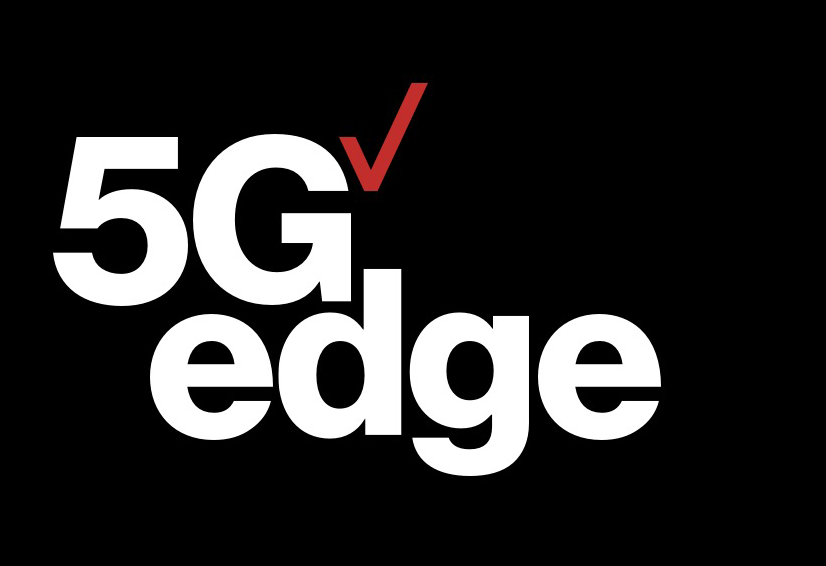

# Verizon 5G Edge Demos & Tutorials
Tutorials, starter guides, and simple projects to launch your first application at the network edge.
> Brought to you by the Verizon 5G Edge Developer Relations Team

**What is 5G Edge?**
Verizon 5G Edge brings the power of the cloud closer to mobile and connected devices at the edge of the Verizon 4G and 5G networks. That means developers can build apps with low latency using familiar cloud services, APIs and tools via seamless extension of your Virtual Private Cloud.

To learn more, check out the [Verizon 5G Edge Developer Resources page](https://www.verizon.com/business/solutions/5g/edge-computing/developer-resources/).

## Table of Contents

- [Background](#background)
- [Install](#install)
- [Usage](#usage)
- [Contribute](#contribute)
- [License](#license)

## Background

We want to make it easier than ever to develop applications for the network edge. To that end, we've created a number of starter projects, tutorials, and infrastructure templates that get your Verizon 5G Edge infrastructure up-and-running in seconds. From there, feel free to experiment with some of the starter applications we've developed, including the following:

**Infrastructure Resources**
 - `terraform`: Get started using HashiCorp Terraform across HAProxy, MongoDB, and AWS Wavelength (EC2/EKS)
 - `cdk-tutorials`: Use the AWS CDK to create starter modules using AWS Wavelength 
 - `cloudformation-templates`: Use AWS CloudFormation to launch your first 5G Edge infrastructure template
 - `sdk-tutorials`: Get started using Boto3 (Python SDK for AWS) across EC2 or EKS
 - `edge-discovery`: Get started with the Verizon edge discovery service, an easy-to-use API to manage multi-Wavelength zone deployments and route mobile clients to the most optimal edge endpoints
 
**Partner Resources**
 - `confluent`: Build your first data streaming application using Confluent for Kubernetes on AWS Wavelength
 - `couchbase`: Build your first auction application on AWS Wavelnegth with Couchbase Server and Sync Gateway
 - `openshift`: Deploying your first OpenShift cluster to AWS Wavelength 
 - `sumologic`: Instrument your first EC2-based edge deployment using Sumo Logic custom collectors
 - `opscruise`: Instrument your first EKS environment using OpsCruise 

## Community Resources

There are a bunch of awesome projects building on Verizon 5G Edge that we wanted to highlight here as well!

- [Olympics-themed computer vision app on AWS Wavelength with MongoDB](https://github.com/kukicado/vz-immersion-day-demo)
- [Instrumenting your EKS cluster with Pixie and New Relic](https://github.com/newrelic-experimental/vz-newrelic-5g-edge)
- [Wavelength MQTT Latency Tester](https://github.com/aws-samples/aws-mqtt-wavelength-latency)
- [MongoDB Realm on AWS Wavelength](https://github.com/VKonanur/MongoDB-Realm-for-Verizon-5G-Edge/)

## Contribute

Please refer to [the contributing.md file](Contributing.md) for information about how to get involved. We welcome issues, questions, and pull requests.

## Maintainers
- Robbie Belson: robert.belson@verizon.com

## License
- This project is licensed under the terms of the [Apache 2.0](LICENSE-Apache-2.0) open source license. Please refer to [LICENSE](LICENSE) for the full terms.
