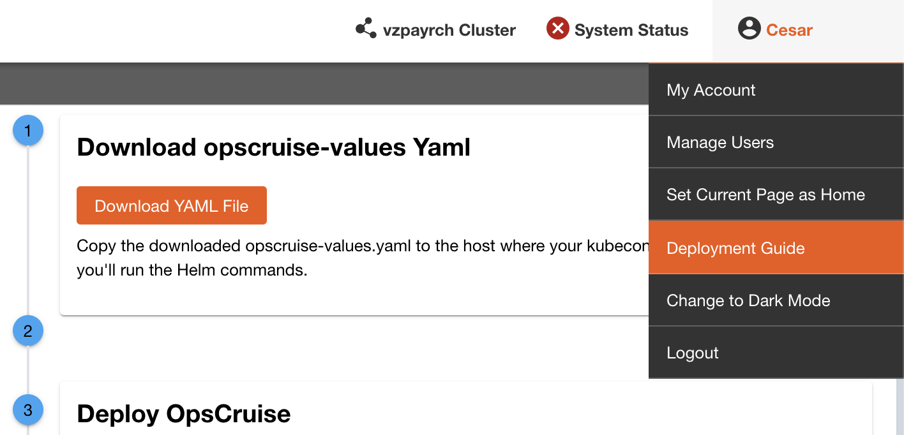

# Deploy EKS Cluster with Worker Nodes in Wavelength Zone

These commands should be run through the aws cli (download here: https://docs.aws.amazon.com/cli/latest/userguide/getting-started-install.html). Uploading the CloudFormation script into the AWS CloudFormation UI and providing the Parameters.

# Getting Started
1. Go to https://opscruise.com/free-forever and sign up for an OpsCruise account.


2. Once your OpsCruise instance has been created, log in to your OpsCruise instance
3. Click on your **user name** in the upper right corner, then **Deployment Guide**
4. Click on **Download YAML File**



5. In Section 2 of the Deployment guide, select **AWS**, then **Amazon Linux**, and follow the instructions to create an IAM role in order to allow OpsCruise to query AWS


6. Upload your opscruise-values.yaml to an S3 bucket and have the URL handy (you’ll need it in Step 7)
7. Run the following commands:


NOTE: The stack-name assumes linux for substitution. If substitution is not working, replace \$(date +%b%d%Y_%H%M) portion in the "--stack-name" parameter. Also, replace OpsCruiseValuesURL, EKSClusterAdminArn, and EKSClusterAdminArn ParameterValues with your actual values.

```
## NOTE: Only run this command once. It creates IAM roles and activates the
## AWSQS Helm and EKS Cluster Types, which only needs to be done once.
## This outputs the Helm Role ARN. Use the ARN in the AWSQSHelmExecutionRole parameter.

aws cloudformation deploy \
    --template-file /Users/qcesarjr/vzw-wavelength-cf-templates/awsqseks-helm-typeactivation.yaml.packaged.yml \
    --stack-name AWSEKSTypeActivation \
    --capabilities CAPABILITY_NAMED_IAM

## To create additional clusters, only run the commands below.

# Deploy the EKS Cluster in Wavelength with OpsCruise.
# Change OpsCruiseValuesURL, EKSClusterAdminArn, EKSClusterAdminName,
# and AWSQSHelmExecutionRole (output from first command) parameters

EKSwOCStackName=eksCluster-wOpsCruise-$(date +%b%d%Y-%H%M)

aws cloudformation deploy --template-file /Users/qcesarjr/vzw-wavelength-cf-templates/wavelength-eksCluster-withOpsCruise.packaged.yml \
    --stack-name $EKSwOCStackName \
    --capabilities CAPABILITY_NAMED_IAM \
    --parameter-overrides \
        OpsCruiseValuesURL="S3_URL_TO_OPSCRUISE_VALUES_YAML" \
        EKSClusterAdminArn=$ARN_FOR_EKS_CLUSTER_ADMIN_USER \
        EKSClusterAdminName=$CLUSTER_ADMIN_USERNAME \
        OpsCruiseGWVersion=3.1.1 \
        OpsCruiseCollectorsVersion=3.1.1 \
        AWSQSHelmExecutionRole=$HELM_EXECUTION_ROLE

# Update your kubeconfig with the created cluster's credentials
aws eks update-kubeconfig --name ${EKSwOCStackName}-k8s